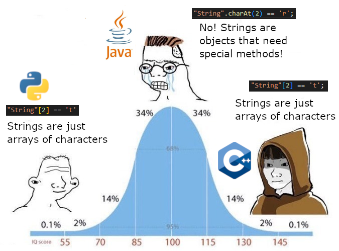

# Strings

---

## Different declarations

<!-- prettier-ignore -->
```js
const string1 = "Hello World!";
const string2 = 'Hello World!':
const string3 = `Hello World!`;
```

---

## Double and single quotes

<!-- prettier-ignore -->
```js
const stringWithQuotes = '"quote from someone" - Someone';
const sentence = "I don't know"; 
const escapeCharater = "\"this\" also works"
```

---

## Strings and arrays

```js
const array = ["H", "e", "l", "l", "o"];
console.log(array[0]); // H

let word = "Hello";
console.log(word[0]); // H
```

---

## Strings and arrays

```js
const array = ["H", "e", "l", "l", "o"];
for (let i = 0; i < array.length; i++) {
  console.log(array[i]);
}

let word = "Hello";
for (let i = 0; i < word.length; i++) {
  console.log(word[i]);
}
```

---

## Changing arrays/strings

```js
const array = ["H", "e", "l", "l", "o"];
for (let i = 0; i < array.length; i++) {
  array[i] = "O";
}

let word = "Hello";
for (let i = 0; i < word.length; i++) {
  word[i] = "O";
}
console.log(array); // ?
console.log(word); // ?
```

---

## String vs array



---

## String comparisons

```js
console.log("hello" === "hello"); // ?
console.log("hello" === "HELLO"); // ?
console.log("hello" < "abba"); // ?
console.log("hello" < "ABBA"); // ?
console.log("a" > "a"); // ?
console.log("A" < "a"); // ?
```

---

## "Behind the scenes"

```js
console.log("A".charCodeAt(0));
console.log("a".charCodeAt(0));
```

---

## String methods

- split
- join
- trim
- toLowerCase
- toUpperCase
- padStart
- padEnd
- slice
- substring
- replace
